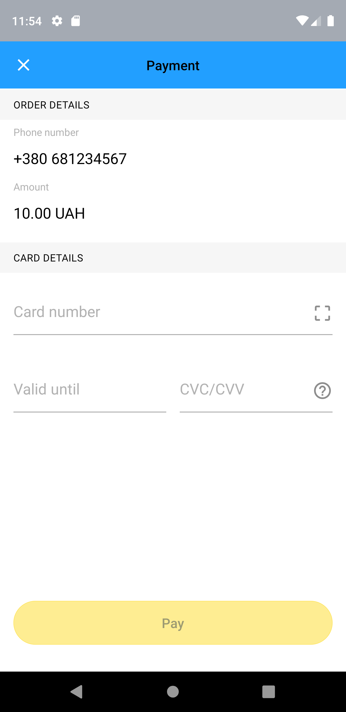

# React Native Ecom Portmone Android/IOS

## Portmone eCommerce Android SDK

## Usage



## General description
Portmone SDK supports version Android 4.4 KitKat, API level 19 and latest versions.

Integration
```$xslt
### build.gradle (project level)
allprojects {
   repositories {
       google()
       jcenter()

       mavenCentral()
       maven {
           url "https://github.com/Portmone/Android-e-Commerce-SDK/raw/master/"
       }

   }
}
### build.gradle (app level)
dependencies {
       implementation 'com.portmone.ecomsdk:ecomsdk:1.3.1'
}
```

### Install

```
$ yarn add react-native-ecom-portmone
```

### Link

- **React Native 0.60+**


[CLI autolink feature](https://github.com/react-native-community/cli/blob/master/docs/autolinking.md) links the module while building the app. 


- **React Native <= 0.59**


```bash
$ react-native link react-native-ecom-portmone
```

### Import

```js
import PortmoneSDK from 'react-native-ecom-portmone';
```

### Invoke portmone SDK
```tsx

// App.js

type Locale = 'uk' | 'ru' | 'en';

const locale: Locale = 'uk';

useEffect( async () => {
    await PortmoneSDK.invokePortmoneSdk(locale);
}, [])

```

### Init pay without save card
```tsx

const payeeId: string = 'Your payee id';
const phoneNumber: string = '681234567';
const amount: number = 10

initPayWithoutCard = async () => {
    await PortmoneSDK.initCardPayment(payeeId, phoneNumber, amount);
}

```
